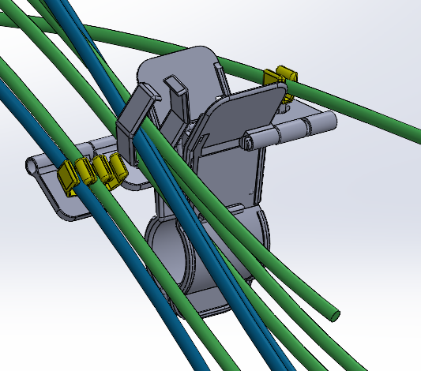
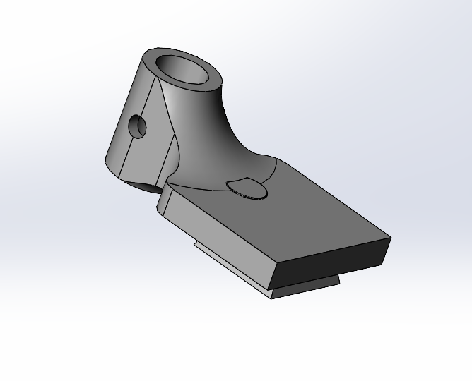
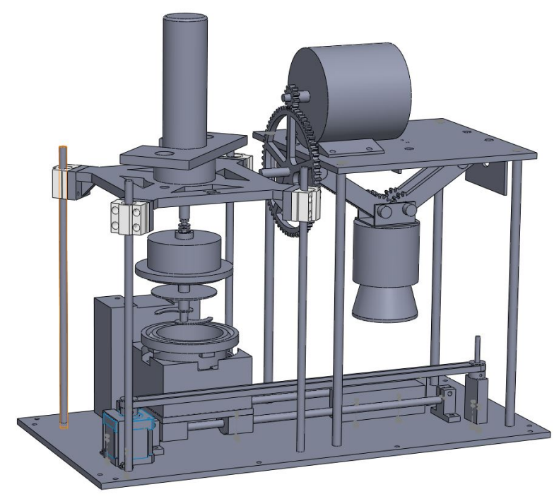
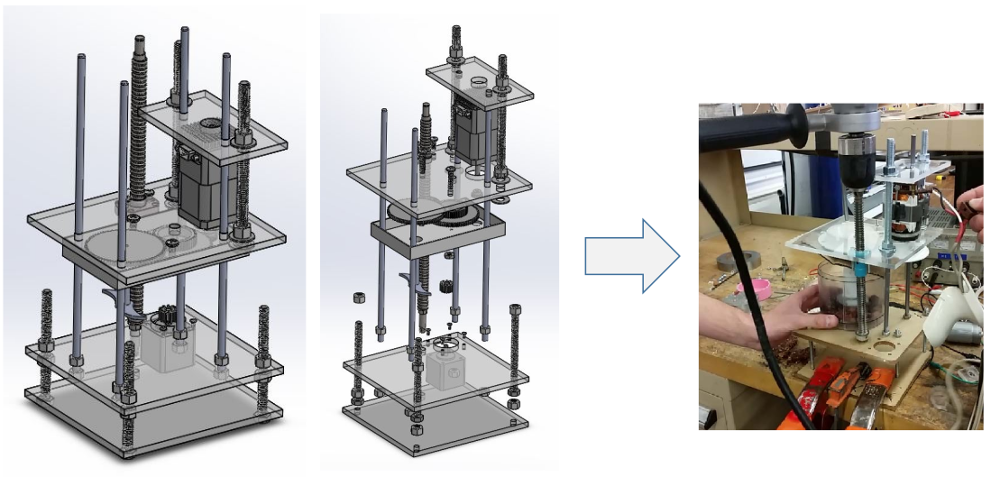
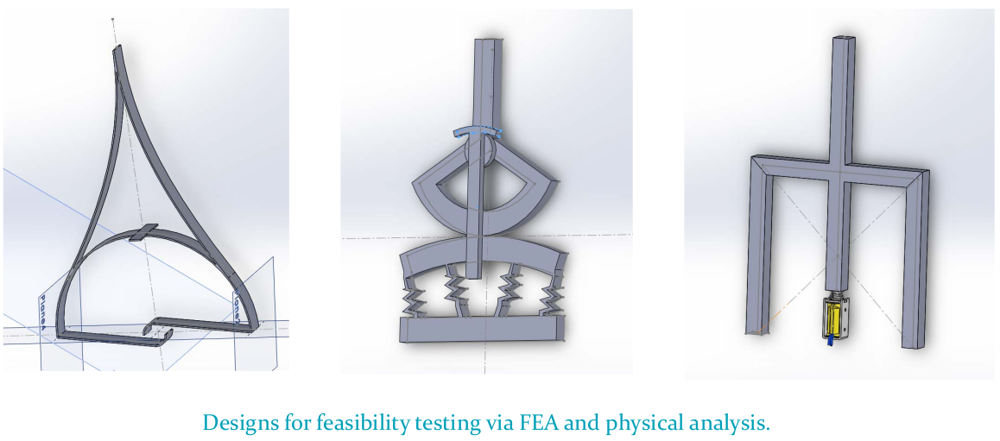
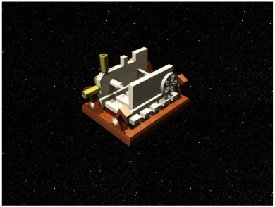
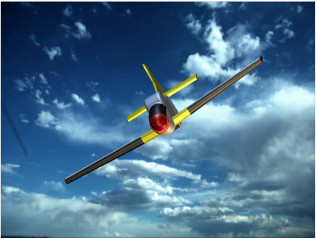

David has worked on a number of CAD projects over the years, almost primarily in Solidworks, with a few at the beginning of his undergraduate studies in Autodesk Inventor. Here are a few of those projects listed with some explanations separated into general years of study.

---
### Professional

**NurseTech Cord Organizer Clamp**: Custom moldable clamp for the ICU to manage cord organization.

---
### Postgraduate

**Full Basic Custom Robot Design**: Custom robot design for housing/controlling actuators for basic medical task.

**Fast Prototyping Concept Example**: Example of quick (under an hour) modelling of new robotic concepts/scenarios for presentations.

**Drill Sample**: Simple force/torque sensor attachment of material for drilling

---
### Graduate

**Tracked Tool Rendering**: Basic rendering of simple custom tool for touching feature points inside of the inner ear of a guinea pig.

**Guinea Pig Head Clamp Table**: An extended table and head clamp design for securing the guinea pig head and registration in preparation for CI insertion surgery in the OR. The clamping portion was modified from an adjustable clamp found on Thingiverse.

**Guinea Pig Cochlea Phantom**: Segmented guinea pig cochlea phantom embedded into resin 3D model for testing CI insertions.

**Omnimagnet Calibration Cube**: A mounting cube to collect spatial magnetic field data to better model the magnetic field of the Omnimagnet used for CI tip steering.

**Tripod Camera Mount**: Small piece for securing and mounting a stereocamera to a tripod.

---
#### Undergraduate

**Automated Food Bar Machine Full Prototype**: Full basic inner structure of full food bar machine first prototype.

**Drill Prototype of Automated Food Bar Machine**: First assembly of the automated drilling mechanism for a food bar machine.

**Haptic Actuators**: Novel Haptic actuator designs for FEA analysis.

**Pipsqueak Engine Render**: A small air engine CAD Model.

**Toy Plane**: A fun toy plane glider modeled loosely after the P-51D Mustang.